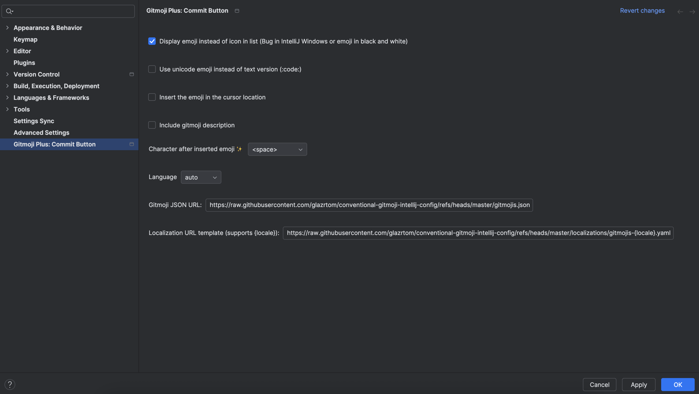

# Conventional gitmoji — configuration for Gitmoji intellij Commit Button plugin

This repository contains a small configuration and translations for using a "conventional gitmoji" commit style with the Gitmoji Plus Commit Button IntelliJ plugin.

> ⚠️ The configuration options is not yet available in the stable release of the plugin. See [this MR](https://github.com/patou/gitmoji-plus-commit-button/pull/164)

## Specification

This configuration implements the [conventional gitmoji concept](https://conventional-gitmoji.web.app/) created by [Ackee](https://ackee.cz). 

With this configuration, it limits the available gitmojis to a small, well-defined set that maps to Conventional Commit intent (feat, fix, docs, etc.). Use the emoji that best communicates why the change was made.

### Allowed emojis and their intent

- ✨ feat — new feature
- 🐛 fix — bug fix
- 👷 build — changes that affect the build system or external dependencies
- 💚 ci — changes to CI configuration and scripts
- 📝 docs — documentation-only changes
- ♻️ refactor — code changes that neither fix bugs nor add features
- ⚡️ perf — performance improvements
- ✅ test — adding or correcting tests
- ⏪️ revert — reverts a previous commit

## Repository contents

- gitmojis.json — plugin configuration listing available gitmojis and their metadata.
- localizations/ — translations for the gitmoji labels (en_US, fr_FR, pt_BR, ru_RU, zh_CN).

## Using this config with the IntelliJ plugin

Install the [Gitmoji Plus Commit Button plugin](https://plugins.jetbrains.com/plugin/12383-gitmoji-plus-commit-button) and point it at this configuration file.

Set the gitmojis url to:

```
https://raw.githubusercontent.com/glazrtom/conventional-gitmoji-intellij-config/refs/heads/master/gitmojis.json
```

and the localization url to:

```
https://raw.githubusercontent.com/glazrtom/conventional-gitmoji-intellij-config/refs/heads/master/localizations/gitmojis-{locale}.yaml
```

The plugin will use the gitmojis.json and the localization files to present a constrained, conventional set of emojis when creating commits.



## License and attribution

This configuration is implementation of the [conventional gitmoji concept](https://conventional-gitmoji.web.app/) created by [Ackee](https://ackee.cz). It is an configuration for use with the [Gitmoji Plus Commit Button plugin](https://plugins.jetbrains.com/plugin/12383-gitmoji-plus-commit-button).

## Contributions

Contributions and localization updates are welcome — open a PR or issue with suggested changes.
